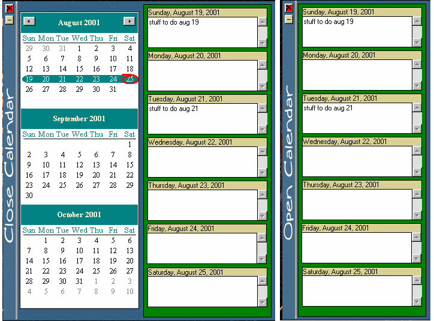



## WeekCalendar v1\.1 update

### Description

weekly selection with a list for entering things to do for the week.

Added checking on saving data to database

when app closes.
 
### More Info
 
you might end up doing some of the stuff you put in the list of things to do.

             |
---                |---
**Submitted On**   |2001-09-16 00:25:12
**By**             |[Sparky](https://github.com/Planet-Source-Code/PSCIndex/blob/master/ByAuthor/sparky.md)
**Level**          |Advanced
**User Rating**    |4.9 (34 globes from 7 users)
**Compatibility**  |VB 6\.0
**Category**       |[Complete Applications](https://github.com/Planet-Source-Code/PSCIndex/blob/master/ByCategory/complete-applications__1-27.md)
**World**          |[Visual Basic](https://github.com/Planet-Source-Code/PSCIndex/blob/master/ByWorld/visual-basic.md)
**Archive File**   |[WeekCalend265139162001\.zip](https://github.com/Planet-Source-Code/sparky-weekcalendar-v1-1-update__1-26654/archive/master.zip)

